# 🏠 RentHelper, iOS Rental Discovery App

RentHelper is a modern iOS application built with SwiftUI that simulates a real rental platform experience. The app allows users to explore listings, interact with landlords, and navigate properties through a clean and structured user journey.

This project focuses on delivering not just features, but a complete product experience with strong architecture, thoughtful UX decisions, and realistic workflows.

---

## ✨ What is RentHelper

RentHelper is designed as a rental discovery platform where users can:

Browse rental listings from a cloud database
View detailed property information
Explore listings on a map
Save favorite properties locally
Contact landlords
Schedule property visits
Simulate reserving a unit with a deposit

The goal is to replicate how a real-world rental app behaves while maintaining clean design and scalable architecture.

---

## 🧠 Core Idea

The app is built around a realistic user journey:

Browse → View → Contact → Schedule → Reserve

Each feature is placed intentionally to reflect how users actually interact with rental platforms.

---

## 🏗 Architecture

The project follows the MVVM architecture pattern:

Views → ViewModels → Services → Data Sources

Views handle UI
ViewModels manage logic and state
Services handle Firebase and integrations
Data sources include Firestore and CoreData

This ensures clean separation of concerns and maintainable code.

---

## 🛠 Technologies

- SwiftUI for UI
- Firebase Authentication for login system
- Firestore for listings data
- Firebase Storage for images
- CoreData for local favorites persistence
- MapKit for map-based exploration
- Stripe (publishable key only) for payment UI simulation

---

## 🚀 Key Features

🔐 Authentication
Secure login and signup with Firebase

🏠 Listings
Dynamic listing feed with images, price, and location

📄 Listing Details
Structured page with clear actions and clean layout

❤️ Favorites
Saved locally with CoreData and persisted across sessions

🗺 Map Exploration
Listings displayed as pins with user location support

📩 Contact Landlord
Form-based communication flow

📅 Book Visit
Schedule viewing with date and time

💳 Reserve Flow
Stripe-based UI to simulate deposit payment

---

## 🔁 Development Iterations

The project was built in progressive iterations to simulate real product development.

### Iteration 1 - Foundation

Project setup
MVVM structure
Firebase integration
Navigation system

### Iteration 2 - Core Functionality

Authentication system
Listings screen
Listing details
Firestore and storage integration

### Iteration 3 - Data and Experience

Favorites with CoreData
Real-time updates
MapKit integration
Search and filtering

### Iteration 4 - Product Completion

Contact landlord flow
Visit booking
Payment simulation
UI and UX refinement

---

## 📱 Application Screens

Screens are available in the `Documentation/` folder.

### Core Experience

<table>
<tr>
<td align="center"><b>Listings</b></td>
<td align="center"><b>Details</b></td>
<td align="center"><b>Map View</b></td>
<td align="center"><b>Clicking on one listing on the Map</b></td>
</tr>
<tr>
<td>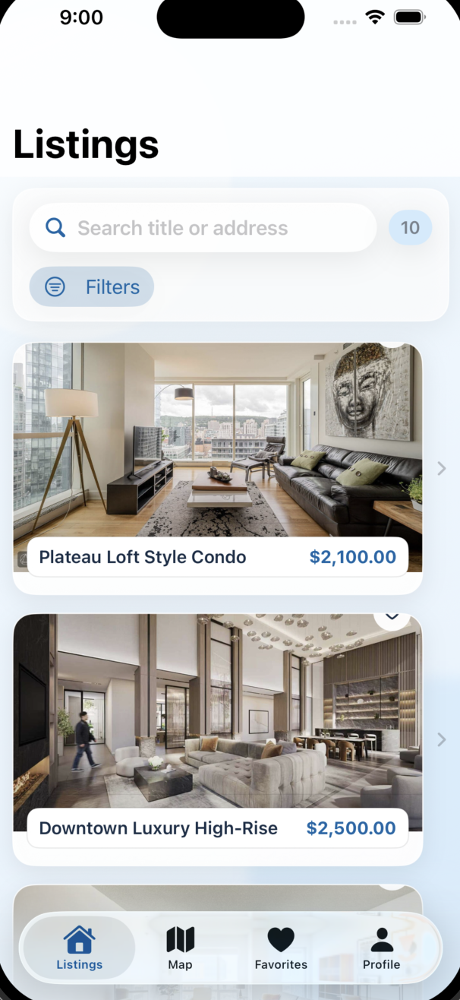</td>
<td>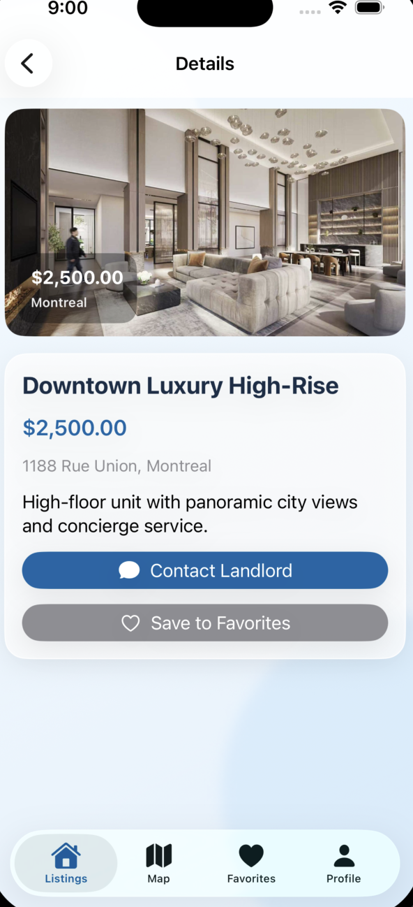</td>
<td>
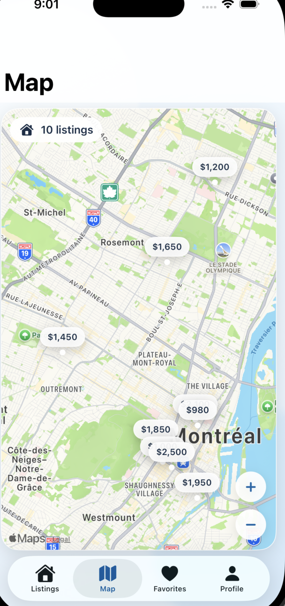</td>
<td>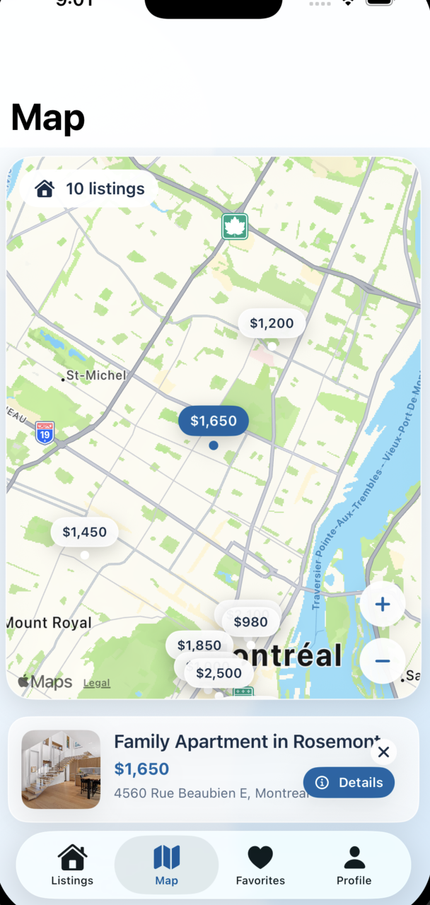</td>
</tr>
</table>

---

### User Actions

<table>
<tr>
<td align="center"><b>Contact & Visit</b></td>
<td align="center"><b>Deposit</b></td>
</tr>
<tr>
<td>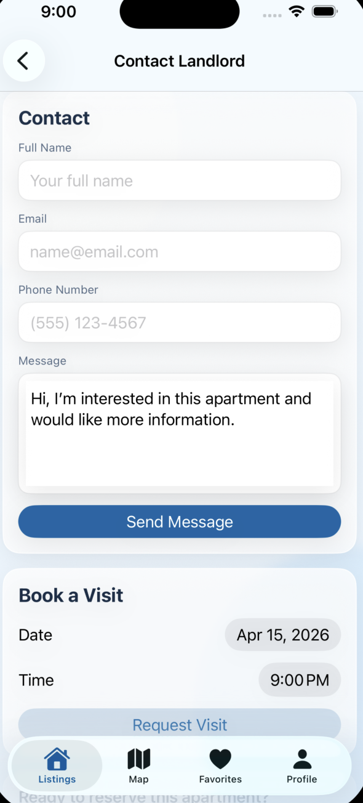</td>
<td>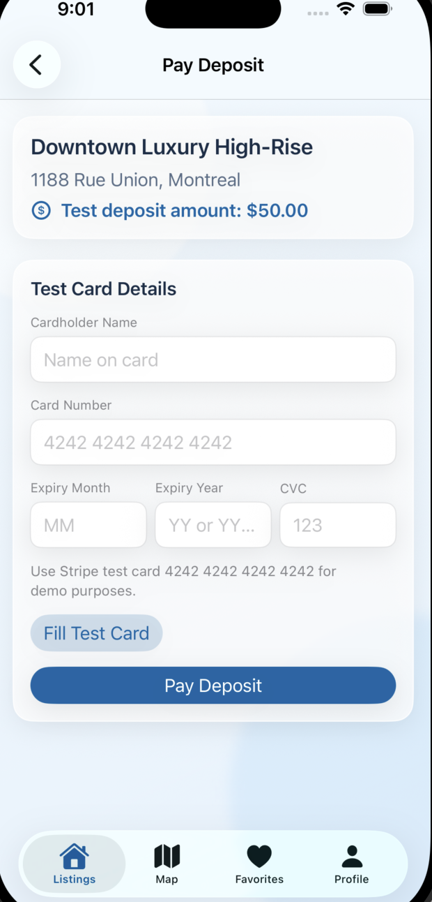</td>
</tr>
</table>

---

### Personalization

<table>
<tr>
<td align="center"><b>Favorites</b></td>
<td align="center"><b>Profile</b></td>
</tr>
<tr>
<td>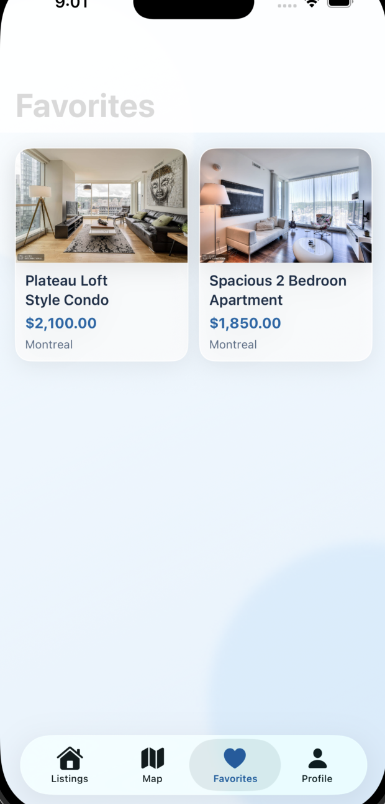</td>
<td>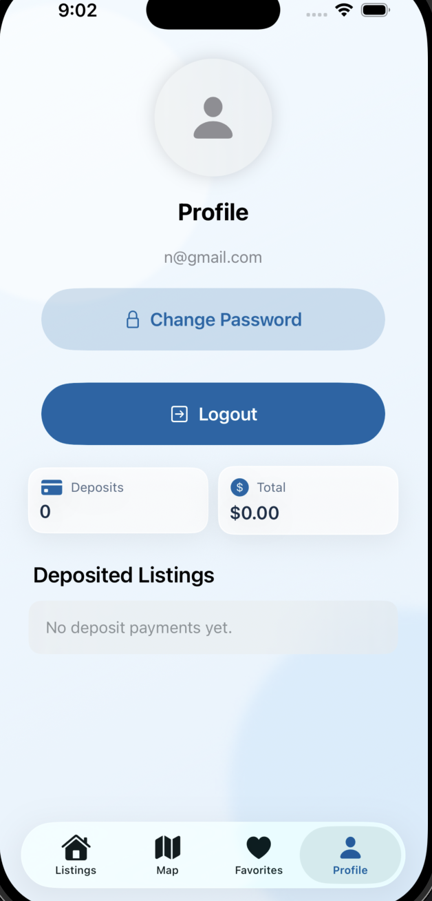</td>
</tr>
</table>

---

### Authentication

<table>
<tr>
<td align="center"><b>Login</b></td>
<td align="center"><b>Sign Up</b></td>
</tr>
<tr>
<td>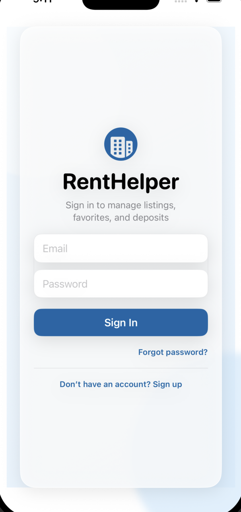</td>
<td>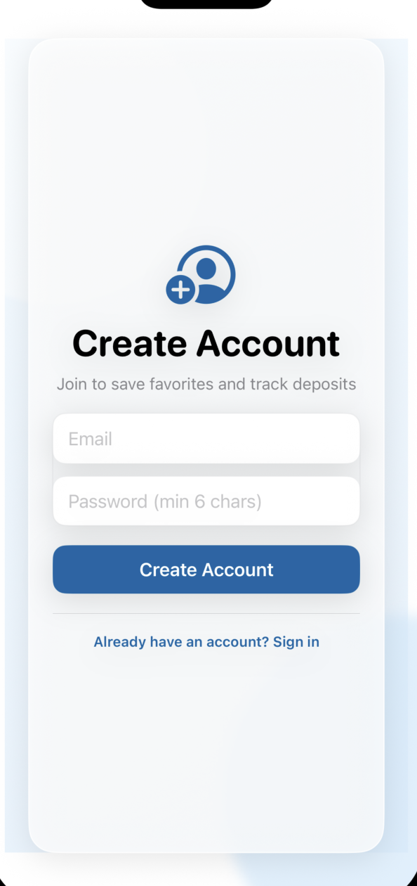</td>
</tr>
</table>

---

### Settings

<table>
<tr>
<td align="center"><b>Change Password</b></td>
</tr>
<tr>
<td>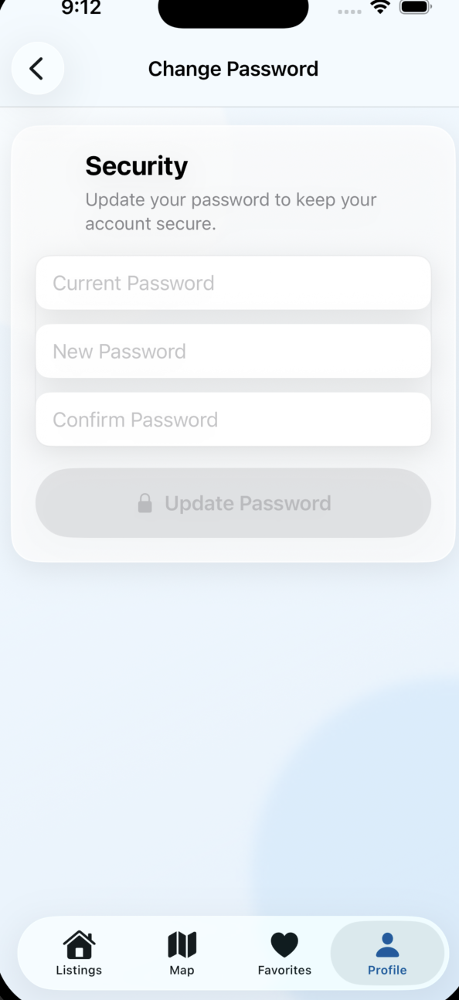</td>
</tr>
</table>

---

## ▶️ Running the Project

Clone the repository:

```bash
git clone https://github.com/negarprh/Rent-Helper.git
cd Rent-Helper
```

Set up Firebase:

Create a Firebase project
Enable Authentication
Enable Firestore
Enable Storage
Download and add `GoogleService-Info.plist`

Open the project in Xcode and run on a simulator.

---

## 🔐 Security

Stripe secret keys are not used
Payment flow is simulated
Sensitive configuration is excluded
Firebase rules control access

---

## 👩‍💻 Team

- Negar Pirasteh
- Betty Dang
- Ngoc Yen Nhi Pham

---

## 📌 Final Note

RentHelper demonstrates how to build a complete mobile product from scratch using modern iOS technologies. The project highlights strong architectural decisions, realistic feature design, and a clear understanding of user experience.

---
